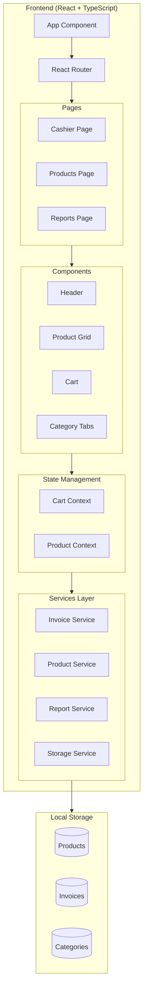
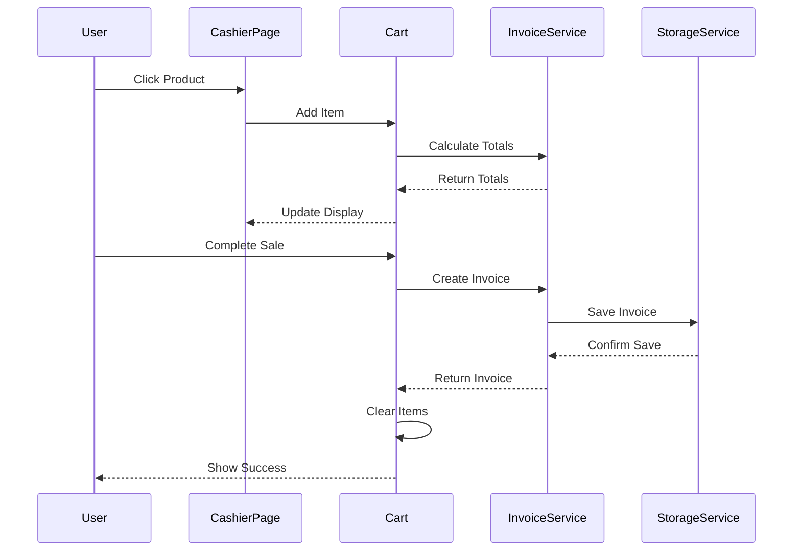

# Design Document: Cafe POS

## Overview

Cafe POS هو نظام نقطة بيع (Point of Sale) مبني باستخدام React و TypeScript للواجهة الأمامية، مع إمكانية الاتصال بـ Backend عبر REST API. النظام يتبع نمط Component-Based Architecture مع استخدام React Context لإدارة الحالة العامة.

### Design Goals

- **سرعة الاستجابة**: إنشاء فاتورة في أقل من 30 ثانية
- **دقة الحسابات**: عدم وجود أخطاء في حسابات الفواتير
- **سهولة الاستخدام**: واجهة بسيطة وواضحة للكاشير
- **قابلية التوسع**: بنية تسمح بإضافة ميزات مستقبلية

## Architecture



### Architecture Decisions

1. **React Context over Redux**: للحفاظ على البساطة في MVP، نستخدم React Context لإدارة الحالة
2. **Local Storage للـ MVP**: نستخدم localStorage للحفظ المحلي مع إمكانية الترقية لـ SQLite لاحقًا
3. **Service Layer Pattern**: فصل منطق العمل عن المكونات لسهولة الاختبار والصيانة
4. **TypeScript**: للحصول على Type Safety وتقليل الأخطاء

## Components and Interfaces

### Page Components

```typescript
// CashierPage - الصفحة الرئيسية للكاشير
interface CashierPageProps {
  // No props - uses context for state
}

// ProductsPage - صفحة إدارة المنتجات
interface ProductsPageProps {
  // No props - uses context for state
}

// ReportsPage - صفحة التقارير
interface ReportsPageProps {
  // No props - fetches data internally
}
```

### Core Components

```typescript
// Header Component
interface HeaderProps {
  title: string;
}

// ProductGrid Component
interface ProductGridProps {
  products: Product[];
  onProductClick: (product: Product) => void;
}

// ProductCard Component
interface ProductCardProps {
  product: Product;
  onClick: () => void;
}

// CategoryTabs Component
interface CategoryTabsProps {
  categories: Category[];
  activeCategory: string | null;
  onCategoryChange: (categoryId: string | null) => void;
}

// Cart Component
interface CartProps {
  items: CartItem[];
  subtotal: number;
  serviceFee: number;
  tax: number;
  total: number;
  onQuantityChange: (itemId: string, delta: number) => void;
  onRemoveItem: (itemId: string) => void;
  onClearCart: () => void;
  onCompleteSale: (paymentMethod: PaymentMethod) => void;
}

// CartItem Component
interface CartItemProps {
  item: CartItem;
  onQuantityChange: (delta: number) => void;
  onRemove: () => void;
}
```

### Service Interfaces

```typescript
// Invoice Service
interface IInvoiceService {
  createInvoice(items: CartItem[], paymentMethod: PaymentMethod): Invoice;
  calculateSubtotal(items: CartItem[]): number;
  calculateServiceFee(subtotal: number): number;
  calculateTax(subtotal: number): number;
  calculateTotal(subtotal: number, serviceFee: number, tax: number): number;
  saveInvoice(invoice: Invoice): void;
  getInvoicesByDate(date: Date): Invoice[];
}

// Product Service
interface IProductService {
  getAllProducts(): Product[];
  getProductsByCategory(categoryId: string): Product[];
  addProduct(product: Omit<Product, 'id'>): Product;
  updateProduct(id: string, product: Partial<Product>): Product;
  deleteProduct(id: string): void;
  validateProduct(product: Partial<Product>): ValidationResult;
}

// Category Service
interface ICategoryService {
  getAllCategories(): Category[];
  addCategory(name: string): Category;
  deleteCategory(id: string): void;
}

// Report Service
interface IReportService {
  getDailyReport(date: Date): DailyReport;
  getTotalSales(date: Date): number;
  getInvoiceCount(date: Date): number;
}

// Storage Service
interface IStorageService {
  save<T>(key: string, data: T): void;
  load<T>(key: string): T | null;
  remove(key: string): void;
}
```

## Data Models

```typescript
// Category Model
interface Category {
  id: string;
  name: string;
}

// Product Model
interface Product {
  id: string;
  name: string;
  price: number;
  categoryId: string;
}

// Cart Item Model
interface CartItem {
  id: string;           // Unique cart item ID
  productId: string;
  productName: string;
  unitPrice: number;
  quantity: number;
}

// Invoice Item Model
interface InvoiceItem {
  productId: string;
  productName: string;
  unitPrice: number;
  quantity: number;
  itemTotal: number;
}

// Invoice Model
interface Invoice {
  id: string;
  invoiceNumber: string;
  dateTime: Date;
  items: InvoiceItem[];
  subtotal: number;
  serviceFee: number;
  tax: number;
  total: number;
  paymentMethod: PaymentMethod;
  isPaid: boolean;
}

// Payment Method Enum
type PaymentMethod = 'cash' | 'card';

// Daily Report Model
interface DailyReport {
  date: Date;
  totalSales: number;
  invoiceCount: number;
  totalRevenue: number;
  invoices: Invoice[];
}

// Validation Result
interface ValidationResult {
  isValid: boolean;
  errors: Record<string, string>;
}

// Configuration
interface POSConfig {
  serviceFeePercentage: number;  // e.g., 0.10 for 10%
  taxPercentage: number;         // e.g., 0.14 for 14%
  currency: string;              // e.g., 'EGP'
}
```

### Data Flow Diagram




## Correctness Properties

*A property is a characteristic or behavior that should hold true across all valid executions of a system—essentially, a formal statement about what the system should do. Properties serve as the bridge between human-readable specifications and machine-verifiable correctness guarantees.*

### Property 1: Category Filtering Correctness

*For any* list of products and any selected category, filtering products by that category SHALL return only products where `product.categoryId === selectedCategoryId`, and the result set SHALL be a subset of the original product list.

**Validates: Requirements 1.2**

### Property 2: Product Addition to Cart

*For any* product clicked in the product grid, the cart SHALL contain an item with matching `productId`, `productName`, and `unitPrice`. If the product already exists in cart, its quantity SHALL increase by 1.

**Validates: Requirements 1.3**

### Property 3: Cart Item Display Completeness

*For any* cart item, the rendered display SHALL contain the product name, unit price, quantity, and item total (where item total = unitPrice × quantity).

**Validates: Requirements 2.1**

### Property 4: Cart Modification Invariants

*For any* cart with items:
- Incrementing an item's quantity SHALL result in `newQuantity = oldQuantity + 1`
- Decrementing an item's quantity (where quantity > 1) SHALL result in `newQuantity = oldQuantity - 1`
- Deleting an item SHALL result in the cart not containing that item
- After any modification, all totals SHALL be recalculated correctly

**Validates: Requirements 2.2, 2.3, 2.5, 2.6**

### Property 5: Invoice Calculation Correctness

*For any* set of cart items with valid prices and quantities, and given configuration values for service fee percentage and tax percentage:
- `subtotal = Σ(item.unitPrice × item.quantity)` for all items
- `serviceFee = subtotal × serviceFeePercentage`
- `tax = subtotal × taxPercentage`
- `total = subtotal + serviceFee + tax`

**Validates: Requirements 3.1, 3.2, 3.3, 3.4**

### Property 6: Monetary Value Formatting

*For any* monetary value displayed in the system, the formatted string SHALL contain exactly 2 decimal places.

**Validates: Requirements 3.6**

### Property 7: Sale Completion Invariants

*For any* completed sale with a non-empty cart:
- The resulting invoice SHALL have `isPaid = true`
- The invoice SHALL be persisted to storage
- The cart SHALL be empty after completion
- The invoice SHALL contain all items that were in the cart

**Validates: Requirements 4.2, 4.3, 4.4**

### Property 8: New Invoice State Reset

*For any* cart state, after initiating a new invoice:
- The cart items array SHALL be empty
- The subtotal SHALL equal 0
- The service fee SHALL equal 0
- The tax SHALL equal 0
- The total SHALL equal 0

**Validates: Requirements 5.1, 5.3**

### Property 9: Product Validation

*For any* product submission:
- If `name` is empty or whitespace-only, validation SHALL fail with a name error
- If `price` is negative or zero, validation SHALL fail with a price error
- If `categoryId` is empty or invalid, validation SHALL fail with a category error
- If all fields are valid, validation SHALL pass

**Validates: Requirements 6.4**

### Property 10: Report Data Accuracy

*For any* date with completed invoices:
- `totalSales` SHALL equal the sum of all invoice totals for that date
- `invoiceCount` SHALL equal the number of invoices for that date
- All returned invoices SHALL have a `dateTime` matching the selected date

**Validates: Requirements 7.2, 7.3**

### Property 11: Data Persistence Round-Trip

*For any* valid product, category, or invoice:
- Saving then loading SHALL return an equivalent object
- `load(save(data)) ≡ data` (structural equality)

**Validates: Requirements 9.1, 9.2, 9.3, 9.4**

## Error Handling

### Input Validation Errors

| Error Type | Condition | User Message |
|------------|-----------|--------------|
| Empty Product Name | name is empty or whitespace | "اسم المنتج مطلوب" |
| Invalid Price | price ≤ 0 | "السعر يجب أن يكون أكبر من صفر" |
| Invalid Category | categoryId not found | "التصنيف غير موجود" |
| Empty Cart Sale | cart.items.length === 0 | "لا يمكن إتمام البيع بدون منتجات" |

### Storage Errors

| Error Type | Condition | Recovery Action |
|------------|-----------|-----------------|
| Storage Full | localStorage quota exceeded | Show warning, suggest clearing old data |
| Parse Error | Invalid JSON in storage | Reset to default data, log error |
| Load Failure | Storage unavailable | Use in-memory storage, warn user |

### Calculation Errors

| Error Type | Condition | Handling |
|------------|-----------|----------|
| Overflow | Total exceeds safe integer | Cap at MAX_SAFE_INTEGER, warn user |
| NaN Result | Invalid arithmetic | Default to 0, log error |
| Negative Total | Calculation error | Set to 0, log error |

## Testing Strategy

### Unit Tests

Unit tests will cover specific examples and edge cases:

1. **Component Rendering Tests**
   - ProductCard renders with correct name and price
   - CartItem displays all required fields
   - Cart shows correct totals

2. **Edge Case Tests**
   - Empty cart behavior
   - Single item cart
   - Maximum quantity limits
   - Zero price handling

3. **Error Condition Tests**
   - Invalid product submission
   - Empty cart sale attempt
   - Storage failure scenarios

### Property-Based Tests

Property-based tests will use **fast-check** library for TypeScript/JavaScript.

Configuration:
- Minimum 100 iterations per property test
- Each test tagged with: **Feature: cafe-pos, Property {number}: {property_text}**

| Property | Test Description | Generator Strategy |
|----------|------------------|-------------------|
| Property 1 | Category filtering | Generate random products with random categories |
| Property 5 | Invoice calculations | Generate random cart items with valid prices (0.01-10000) |
| Property 6 | Monetary formatting | Generate random numbers, verify 2 decimal places |
| Property 9 | Product validation | Generate products with various invalid combinations |
| Property 11 | Persistence round-trip | Generate random valid entities, save/load |

### Integration Tests

1. **Full Sale Flow**: Add products → Modify cart → Complete sale → Verify invoice
2. **Product Management Flow**: Add product → Edit → Delete → Verify changes
3. **Report Generation**: Complete multiple sales → Generate report → Verify accuracy

### Test File Structure

```
src/
├── services/
│   ├── __tests__/
│   │   ├── invoiceService.test.ts
│   │   ├── invoiceService.property.test.ts
│   │   ├── productService.test.ts
│   │   ├── productService.property.test.ts
│   │   ├── storageService.test.ts
│   │   └── storageService.property.test.ts
├── components/
│   ├── pos/
│   │   └── __tests__/
│   │       ├── Cart.test.tsx
│   │       ├── ProductGrid.test.tsx
│   │       └── CartItem.test.tsx
```
